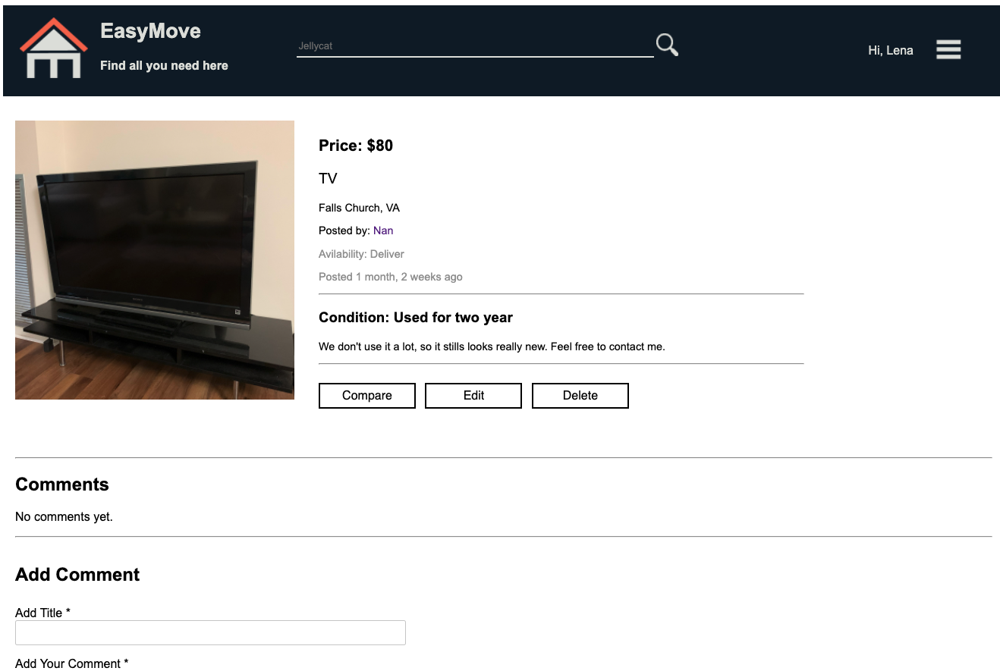

# EasyMove_Webapp_Django

https://cs5774final.herokuapp.com/EasyMove/

## Purpose

The purpose of this website is to provide a platform for international students to exchangeinformation on the sale of used furniture. Users can find information about used furniture being soldhere and can also post items they want to sell.

The intended user of this Web App is mainly international student who needs to buy and sell usedfurniture. In addition, residents in the same community are also potential users.

Users can register or browse the home page of the website as a guest. A registered user could checkthe detail of the item, leave comment for the items, as well as review the profile of other users. Inaddition, a registered user could also publish, edit and delete the items that they want to sell. Eachuser have thier own profile, which include thier inforamtion and recent activities. An admin user couldedit and delete the item that were published by the regular users. 

## Web Interface

### Home Interface

### Item Detail

